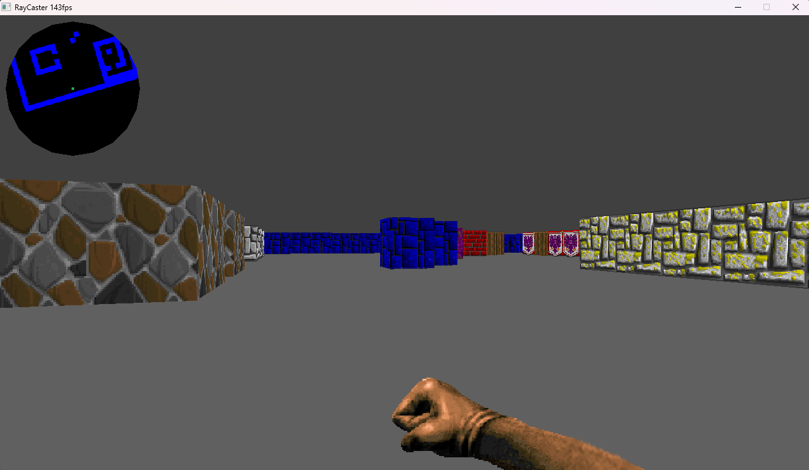

# Simple wolf3d-style raycaster

## Build instructions
Right now there is only support for windows. Compiler this uses is gcc. Compiling with other compilers may not work because of __FUNCTION__ macro in the logger.h file in the include folder. If compiling with another compiler be wary of this

### Windows
cd into the root directory of repo then run
```
make -j
```
## Screenshots 


