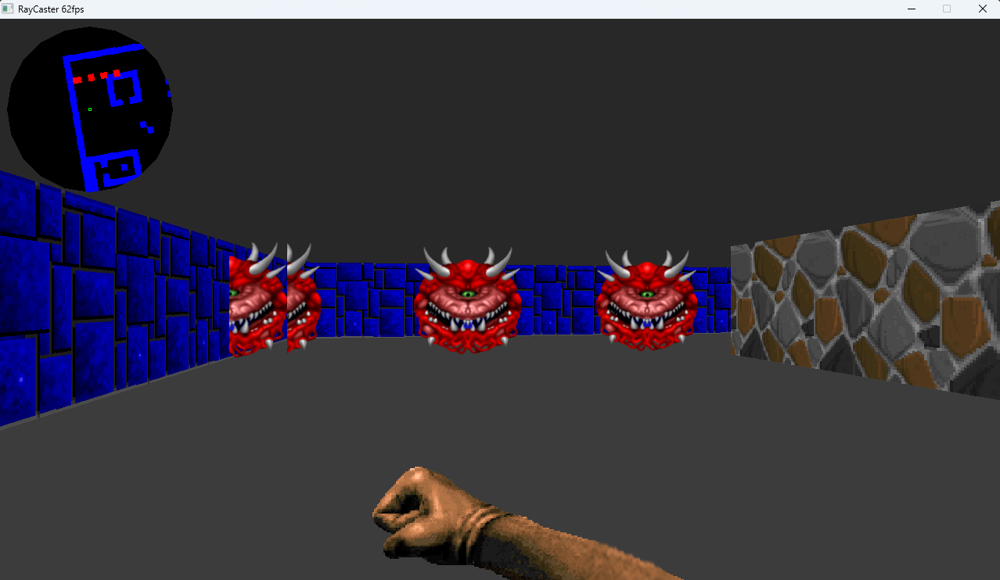
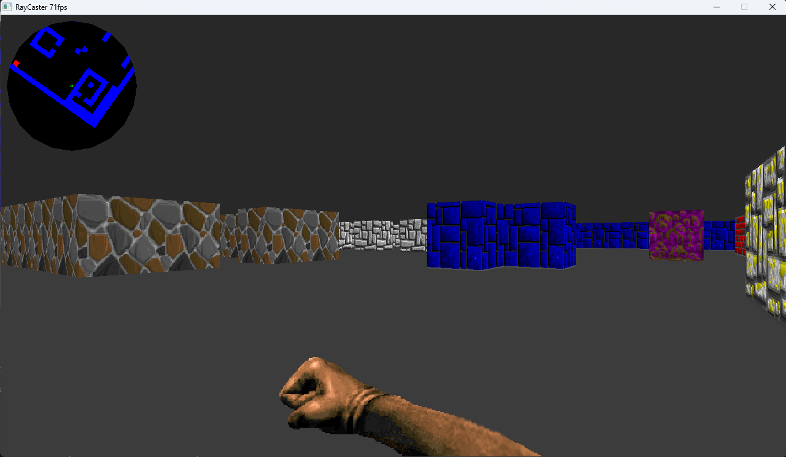
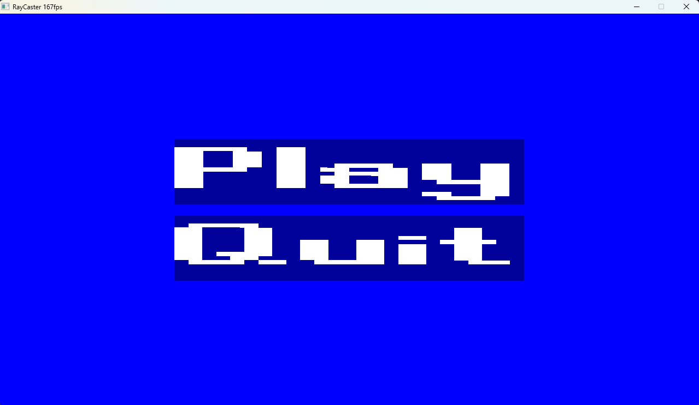
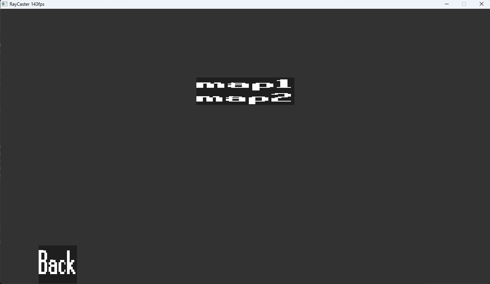

# Simple wolf3d-style raycaster

## Build instructions
There is support for linux and for windows. There will not be a macOS port. Compiler this uses is gcc. Compiling with other compilers may not work because of __FUNCTION__ macro in the logger.h file in the include folder. If compiling with another compiler be wary of this. For linux you must have some packages installed yourself. More details for linux below

### Windows
cd into the root directory of repo then run
```
make -j
```

### Linux
you must have the following packages installed
SDL2
SDL2_image
SDL2_ttf
SDL2_mixer

once you have these installed you can compile from scratch

simply run
'''
make -j
'''

## Screenshots 




